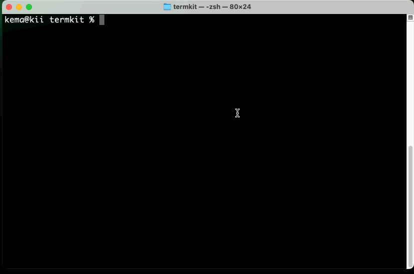

# @imnull/termkit

基于`NodeJS`的`CLI`工具。

# ColorText 着色

## colors

```ts
import { colors } from '@imnull/termkit'

// 输出黄色文字
console.log(colors.yellow(' abc '))
// 输出带背景色文字
console.log(colors.blue(' abc ', { background: 'brightBlue' }))
```

## ColorText

```ts
import { ColorText } from '@imnull/termkit'

const txt = new ColorText({
    color: 'red',
    background: 'brightBlack',
    bold: true,
})

// 内部调用`console.log`输出
txt.log(' xyz ')
// 作为模版渲染文字
console.log(txt.render(' abc '))
```

# TextFrames 文本帧

目的是为了在`CLI`中显示文本动画。定义抽象基类`TextFrames`，包含了通用操作和渲染方法。

在`TextFrames`内部包含一个文本序列，用于实现帧动画效果。每次渲染时，内部索引会向前步进，循环渲染则会出现动画效果。

继承`TextFrames`，实现了`RollingFrames`和`DotsFrames`。

## RollingFrames

实现类似`npm`安装过程的6点字符旋转。

```ts
export class RollingFrames extends TextFrames {
    constructor() {
        super(['⠋', '⠙', '⠹', '⠸', '⠼', '⠴', '⠦', '⠧', '⠇', '⠏'])
    }
}
```

## DotsFrames

实现3个点横滚效果。

```ts
export class DotsFrames extends TextFrames {
    constructor() {
        super(['   ', '.  ', '.. ', '...', ' ..', '  .'])
    }
}
```

# Progress 进度条

进度条，模拟`npm`安装过程的进度展示。

```ts
import { Progress } from '@imnull/termkit'

const progress = new Progress()
console.log(progress.render(0.75))
```

```sh
[#############⠂⠂⠂⠂⠂]
```

# TermFlasher 单行更新

在`CLI`输出内容前，会先清除上一次输出内容，防止终端过多输出内容。

```ts
import { TermFlasher } from '@imnull/termkit'

const term = new TermFlasher()
const max = 50
let index = 0;
const interval = setInterval(() => {
    term.log(`${index} / ${max}`);
    index += 1
    if (index > max) {
        clearInterval(interval)
        term.reset()
    }
}, 100);
```

## TermFlasher.log(msg: string)

输出内容。

## TermFlasher.reset()

清理输出，重置光标，清空历史记录。

# Demo

